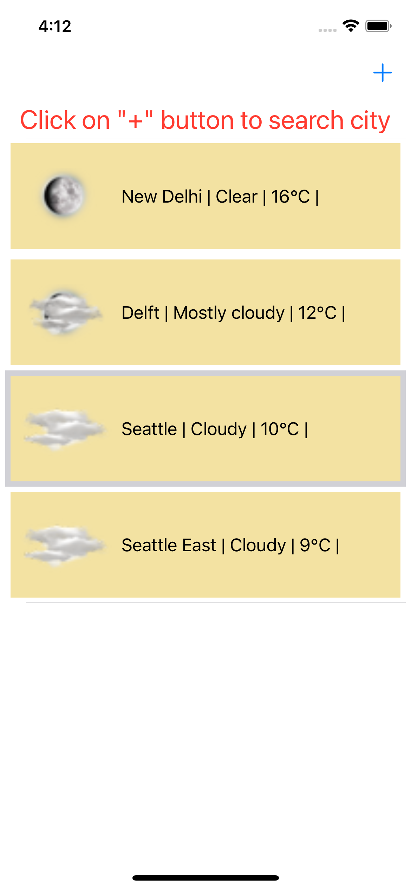
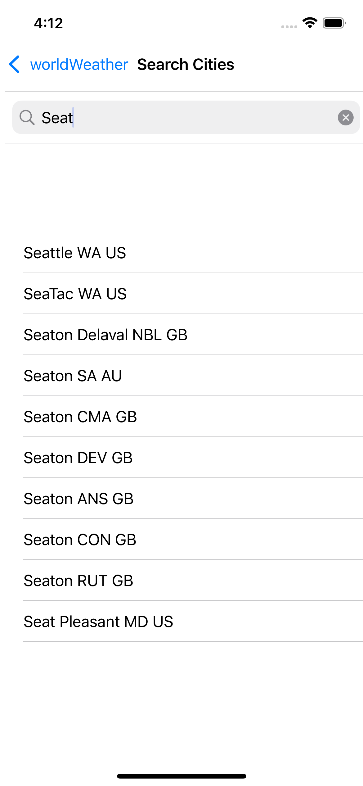

# WeatherApp

WeatherApp is an iOS app for showing real time weather for selected place by user. It uses [AccuWeather](https://developer.accuweather.com/apis) API to fetch Information
It uses following Accuweather API's

- Current Condition API to fetch the weather information for a given location 
- Location API to fetch the city name and id based on the provided prefix for autocompletion.

# Implementation 

## Tech Stack 
- SWIFT Programming Language
- Libraries Used
    - AlamoFire
    - SwiftyJSON
    - Realm
    
# Screenshots

## Home Screen

## Search Screen 

